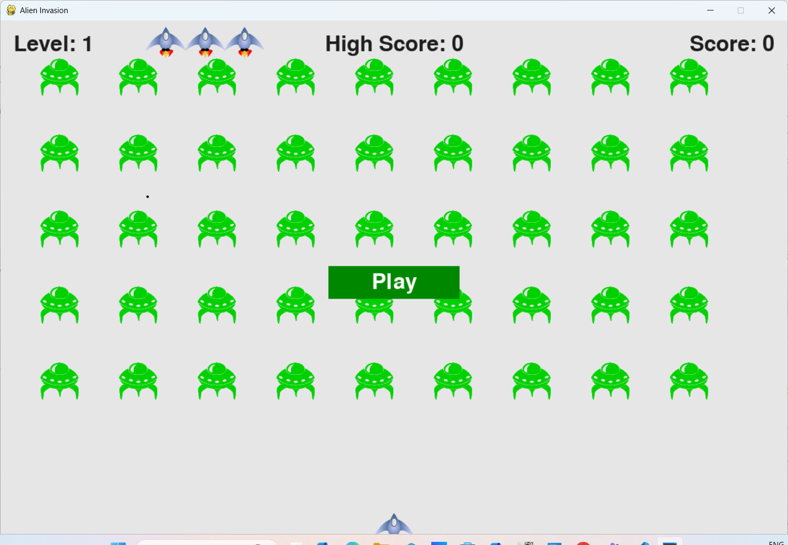
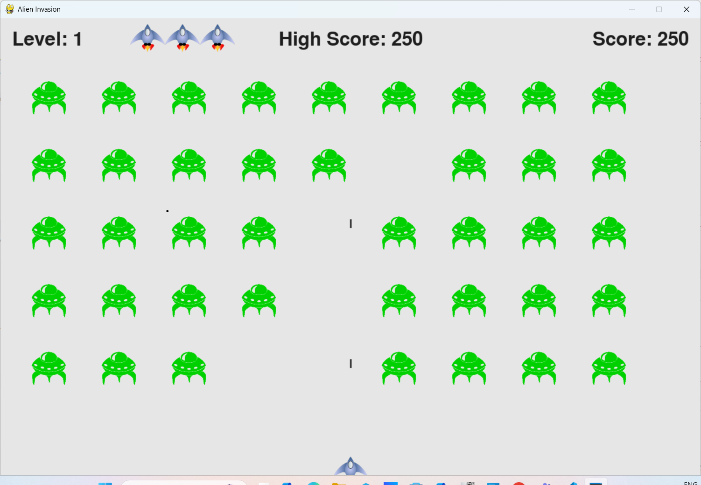

# Alien Invasion Game

This is a Python-based game project built using the `pygame` library. The game involves an alien invasion scenario where players must defend against waves of alien attackers.

---

## Features

- **Interactive Gameplay**: Control your spaceship and defend against alien invaders.
- **Customizable Settings**: Modify game settings like screen resolution, difficulty, and more (Throgh codebase).
- **Smooth Animations**: Powered by the `pygame` library for seamless graphics and animations.
- **Unit Tests**: Includes test cases to ensure the reliability of core game functions.

---

## Installation

1. Clone the repository:
    ```bash
    git clone https://github.com/nitinsingh98/Alien-Invasion.git
    cd alien-invasion
    ```

2. Install dependencies:
    ```bash
    pip install -r requirements.txt
    ```

3. Run the game:
    ```bash
    python main.py
    ```

---

## How to Play
- Press Play button to start the game
- Use arrow keys to move your spaceship.
- Press the spacebar to shoot.
- Avoid alien attacks and destroy all invaders to win.

---

## Testing

This project includes unit tests to ensure the core functionality of the game. To run the tests, use:
```bash
python -m pytest
```

---

## Screenshots

### Main Menu


### Gameplay


---

## Contributing

Contributions are welcome! Please follow these steps:

1. Fork the repository.
2. Create a new branch for your feature or bug fix.
3. Submit a pull request with a detailed description of your changes.

---

## License

This project is licensed under the MIT License. See the [LICENSE](LICENSE) file for details.

---

## Acknowledgments

- Built with the amazing `pygame` library.
- Inspired by classic arcade games.

Enjoy the game!
